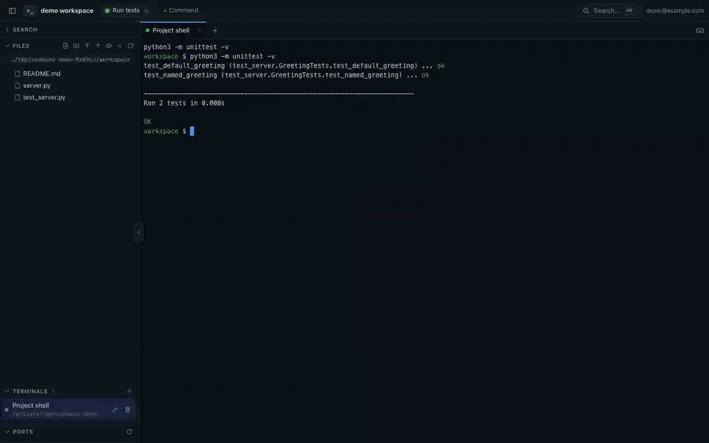

# codeenv

Terminals, files, and development web apps in your browser. codeenv runs on a
VPS behind a Cloudflare Tunnel protected by Cloudflare Access. The Rust binary
includes the web interface.

[Website and demo](https://leyoshe.github.io/codeenv/) ·
[Documentation](docs/README.md) · [Contributing](CONTRIBUTING.md)

[](https://leyoshe.github.io/codeenv/#tour)

## Features

- **Persistent terminals**: shells keep running after a disconnect or a
  codeenv restart. Reconnecting restores the screen and scrollback.
- **Files**: browse, create, move, and delete files. The CodeMirror editor has
  syntax highlighting, preserves line endings and permissions, and warns
  when a file has changed on disk.
- **Search**: search file contents, regular expressions, and file names,
  respecting `.gitignore` and `.ignore`.
- **Transfers**: drag and drop files and folders to upload them, download
  folders as ZIP archives, and preview images and PDFs.
- **Commands**: personal or shared buttons to run commands in new terminals.
- **Port forwarding**: access local servers through separate subdomains,
  including WebSockets. Terminal links to `localhost` use forwarding when
  configured.
- **Mobile**: a collapsible sidebar and extra terminal keys.

Each Access user has their own terminal list and saved commands. All users
share the service's Unix account.

## Installation

Download an archive from [GitHub Releases](https://github.com/leyoshe/codeenv/releases)
and extract it. The archives include the binary, configuration examples, docs,
and dependency licenses. Builds are provided for Linux AMD64, Linux ARM64,
and macOS ARM64. Linux binaries require glibc 2.35+; macOS binaries target
macOS 14+ and are not notarized. Until the first release is published, build
from source:

```sh
cargo build --release
```

Follow the [deployment guide](docs/deployment.md) to install the binary and
configure systemd, the tunnel, Access, and domain names. Settings are described
in [config.example.toml](config.example.toml).

Keep `KillMode=process` in the service so terminals survive server restarts.
The separate `codeenv ptyd` daemon manages them and writes to
`data_dir/ptyd.log`. An incompatible protocol update requires restarting the
daemon, which closes its terminals.

## Usage

Click a file to open it; double-click to focus the editor. Double-click a
folder to open a terminal. Drag a file from the explorer into a terminal to
insert its path.

Closing a **terminal tab inside codeenv** stops that terminal. The hide-tab
menu action keeps it running, as does closing the browser tab. Find hidden
terminals in the terminal panel.

| Shortcut | Action |
|---|---|
| `Alt+Shift+T` | New terminal in the selected folder |
| `Alt+Shift+P` or `⌘K` on Mac | Command palette and file search |
| `Alt+Shift+W` | Close the tab |
| `Alt+Shift+←/→` or `Alt+Shift+1…9` | Switch tabs |
| `Alt+Shift+F` | Search file contents |
| `Alt+Shift+E` | Focus the explorer |
| `Alt+Shift+B` | Toggle the sidebar |
| `Ctrl+S` or `⌘S` | Save in the editor |
| `F2` / `Delete` | Rename / delete in the explorer |

`Alt+Shift` shortcuts work outside terminal and editor views. In a terminal,
keys go to the running program, except `⌘K` and shortcuts reserved by the
browser. The keyboard button enables fullscreen and keyboard lock in browsers
that support them.

Terminal selections are copied automatically when the browser grants clipboard
access. When a program captures the mouse, use `Shift+drag` (`⌥+drag` on Mac)
to select text.

## Development

```sh
cat > dev.toml <<'CONFIG'
listen = "127.0.0.1:7690"
root = "."
[auth]
mode = "insecure"
user = "dev@example.com"
CONFIG
cargo run -- -c dev.toml
```

Open `http://127.0.0.1:7690`. Debug builds read `web/` from disk, so reloading
the page picks up frontend changes. Release builds require recompilation.

```sh
cargo fmt --check
cargo clippy --all-targets -- -D warnings
cargo test
node --check web/app.js
```

The frontend uses JavaScript without a build step. Only the CodeMirror bundle
is built separately: run `npm ci && npm run build` in `tools/codemirror/`.

## Layout

| Files | Purpose |
|---|---|
| `src/main.rs`, `config.rs` | Startup and configuration |
| `src/auth.rs`, `api.rs`, `assets.rs` | Authentication, API, and web assets |
| `src/ptyd.rs`, `pty.rs`, `terminal.rs` | Terminal daemon, client, and WebSocket bridge |
| `src/files.rs`, `transfer.rs`, `search.rs` | Files, transfers, and search |
| `src/proxy.rs`, `ports.rs`, `procinfo.rs` | Port forwarding and process information |
| `src/store.rs` | Personal commands stored as JSON |
| `web/` | Interface; third-party libraries are in `web/vendor/` |

See the [API reference](docs/api.md), [ptyd protocol](docs/protocol.md), and
[troubleshooting guide](docs/troubleshooting.md).

## Security

An authenticated Access user gets a full shell under the service's Unix
account. Use a dedicated account without passwordless sudo. Separating
terminal lists by email does not provide system isolation.

In production, use Cloudflare Access and set `hosts`. The `insecure` mode is
for local development only and requires a loopback listening address. Do not
expose it through a tunnel.

Each forwarded app gets its own subdomain. The proxy removes the Access token
and cookie, and restricts response cookies to the app's hostname. The API
rejects detected cross-origin requests.

The explorer checks that resolved paths stay within `root`. This restriction
does not apply to shell commands and does not replace Unix permissions. SVG
previews use a CSP `sandbox` policy.

## Contributing and license

See [CONTRIBUTING.md](CONTRIBUTING.md) for local development, issue reports,
and pull requests. Report vulnerabilities through the private channel in
[SECURITY.md](SECURITY.md).

codeenv is [MIT licensed](LICENSE). Bundled dependencies retain their own
[licenses and notices](THIRD_PARTY_NOTICES.md). Maintainers can find GitHub
setup, Pages deployment, and release steps in [the release guide](docs/releasing.md).
